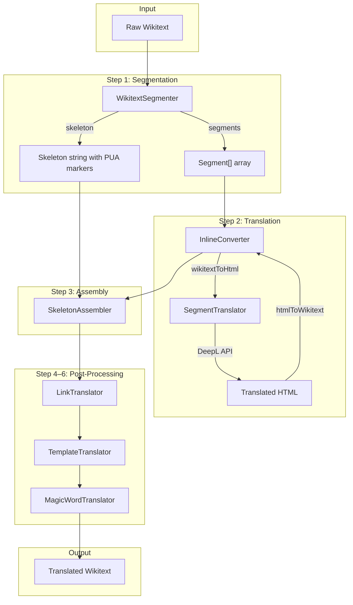
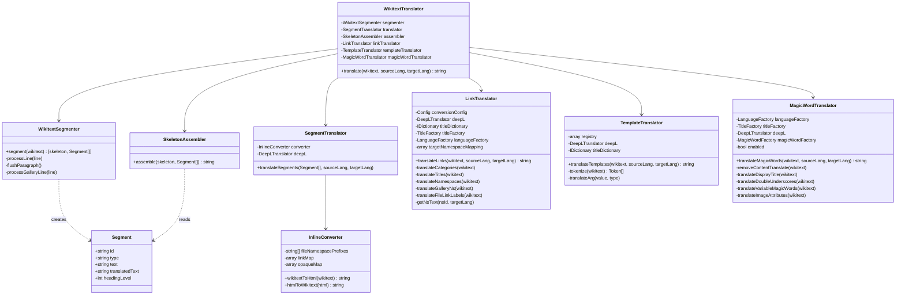

# Translation Pipeline — Class Diagram

> **Viewing Mermaid diagrams:**
> - **GitHub**: renders Mermaid blocks natively in `.md` file preview
> - **PHPStorm**: install the "Mermaid" plugin (Settings → Plugins → search "Mermaid")
> - **Obsidian**: Mermaid is supported out of the box (no plugin needed)
> - **VS Code**: install "Markdown Preview Mermaid Support" extension
>
> Alternatively, see the **ASCII Data Flow** diagram below — it requires no plugin.

## Pipeline Flow (Mermaid)



## Class Relationships



## Data Flow (ASCII)

```
┌───────────────────────────────────────────────────────────────────────┐
│                         Raw Wikitext Input                            │
└──────────────────────────────────┬────────────────────────────────────┘
                                   │
                                   ▼
┌───────────────────────────────────────────────────────────────────────┐
│  STEP 1: WikitextSegmenter                                            │
│                                                                       │
│  Line-by-line parser. Outputs:                                        │
│    • Skeleton: structural wikitext with PUA markers                   │
│    • Segments: translatable text pieces                               │
│                                                                       │
│  Skeleton output:           Segments output:                          │
│    == ␀PH_1␁ ==              Segment{id:1, text:"Title", heading}     │
│    ␀PH_2␁                    Segment{id:2, text:"Paragraph", para}    │
│    {| class="wikitable"      Segment{id:3, text:"Cell", cell}         │
│    | ␀PH_3␁                                                           │
│    |}                                                                 │
└──────────┬────────────────────────────────┬───────────────────────────┘
           │ skeleton                       │ segments
           │                                ▼
           │        ┌───────────────────────────────────────────────────┐
           │        │  STEP 2: SegmentTranslator                        │
           │        │                                                   │
           │        │  For each segment:                                │
           │        │    InlineConverter.wikitextToHtml()               │
           │        │      "'''bold''' text" → "<b>bold</b> text"       │
           │        │    DeepL API (batched, JSON body)                 │
           │        │      "<b>bold</b> text" → "<b>fett</b> Text"      │
           │        │    InlineConverter.htmlToWikitext()               │
           │        │      "<b>fett</b> Text" → "'''fett''' Text"       │
           │        └───────────────────────┬───────────────────────────┘
           │                                │ translated segments
           ▼                                ▼
┌───────────────────────────────────────────────────────────────────────┐
│  STEP 3: SkeletonAssembler                                            │
│                                                                       │
│  Replaces PUA markers with translated text:                           │
│    == '''fett''' Text ==                                              │
│    Übersetzter Absatz                                                 │
│    {| class="wikitable"                                               │
│    | Zelle                                                            │
│    |}                                                                 │
└──────────────────────────────────┬────────────────────────────────────┘
                                   │
                                   ▼
┌───────────────────────────────────────────────────────────────────────┐
│  STEP 4: LinkTranslator                                               │
│                                                                       │
│  Regex-based [[...]] processing:                                      │
│    [[Category:Cats]] → [[Kategorie:Katzen]]                           │
│    [[Help:FAQ]]      → [[Hilfe:FAQ_DE]]                               │
│    [[File:X.jpg|thumb|Nice photo]] → [[Datei:X.jpg|thumb|Foto]]       │
└──────────────────────────────────┬────────────────────────────────────┘
                                   │
                                   ▼
┌───────────────────────────────────────────────────────────────────────┐
│  STEP 5: TemplateTranslator                                           │
│                                                                       │
│  State-machine tokenizer finds templates in registry:                 │
│    {{Hint box|text=Click here}} → {{Hint box|text=Hier klicken}}      │
│    {{ButtonLink|title=Main Page}} → {{ButtonLink|title=Hauptseite}}   │
└──────────────────────────────────┬────────────────────────────────────┘
                                   │
                                   ▼
┌───────────────────────────────────────────────────────────────────────┐
│  STEP 6: MagicWordTranslator                                          │
│                                                                       │
│  Normalizes magic words to English:                                   │
│    __INHALTSVERZEICHNIS__ → __TOC__                                   │
│    {{SEITENNAME}}         → {{PAGENAME}}                              │
│    {{SEITENTITEL:Titel}}  → {{DISPLAYTITLE:Translated Title}}         │
│    [[Datei:X.jpg|miniatur|zentriert]] →                               │
│         [[Datei:X.jpg|thumb|center]]                                  │
└──────────────────────────────────┬────────────────────────────────────┘
                                   │
                                   ▼
┌───────────────────────────────────────────────────────────────────────┐
│                        Translated Wikitext Output                     │
└───────────────────────────────────────────────────────────────────────┘
```

## Segment Extraction Example

Input wikitext:
```
== Introduction ==
This is a '''paragraph''' with [[a link]].

{| class="wikitable"
| Cell one
| Cell two
|}
```

After segmentation:

**Skeleton:**
```
== ␀PH_1␁ ==
␀PH_2␁

{| class="wikitable"
| ␀PH_3␁
| ␀PH_4␁
|}
```

**Segments:**
```
[0] {id: "1", type: "heading", level: 2, text: "Introduction"}
[1] {id: "2", type: "paragraph", text: "This is a '''paragraph''' with [[a link]]."}
[2] {id: "3", type: "table-cell", text: "Cell one"}
[3] {id: "4", type: "table-cell", text: "Cell two"}
```
